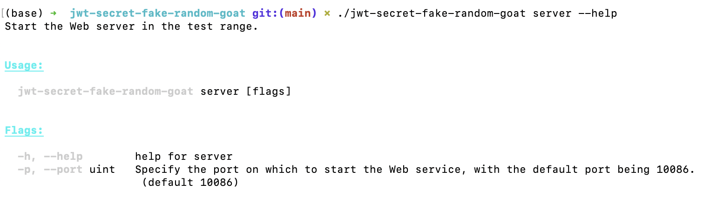
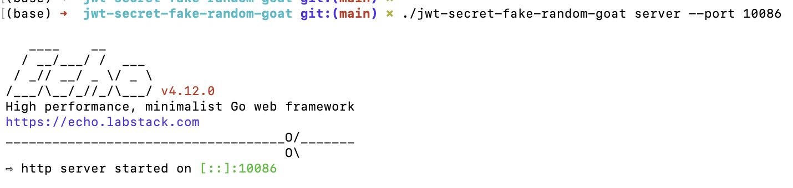
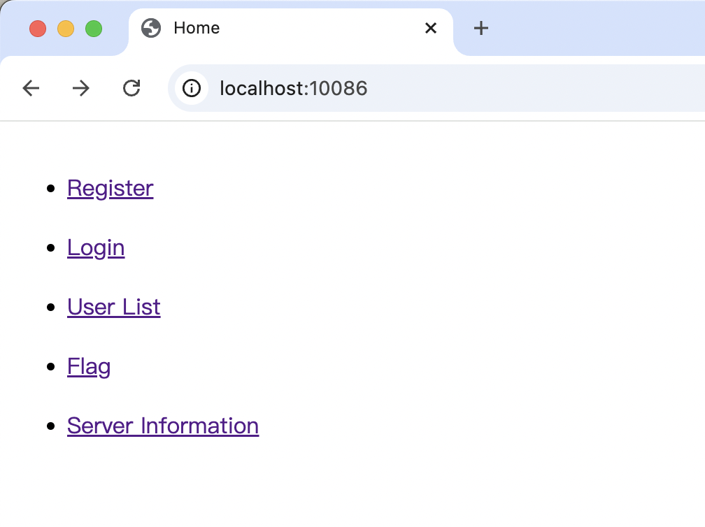

# JWT 伪随机生成secret案例练习靶场

# 一、这是什么？

在很多**开源**系统中，使用的是JWT作为认证体系，而JWT里最关键的是secret，对于secret一般有几种做法：
- 直接在配置文件中写死，对于开源系统来说会导致默认密码攻击，一般不推荐这种做法
- 程序启动时随机生成JWT的secret，后面就使用这个secret来签署JWT Token，看上去很安全，可是这个随机生成真的随机吗？

这个靶场就是把随机生成JWT的secret的场景抽象了一个最小化部分出来，来尝试攻击它获取flag吧！

提示：弱PRNG攻击！
# 二、启动服务

## 2.1 获取可执行文件 

### 方式一：下载预编译文件

在Release页面下载自己系统对应的编译好的二进制文件：

```text
https://github.com/cryptography-research-lab/jwt-secret-fake-random-goat/releases
```

### 方式二：自行编译

自行编译需要安装了Golang，克隆仓库：

```bash
git clone https://github.com/cryptography-research-lab/jwt-secret-fake-random-goat.git
```

进入克隆的仓库，编译源代码：

```bash
go build
```

然后执行编译产物：

```bash
./jwt-secret-fake-random-goat
```

## 2.2 启动服务

执行看一下用法：


需要关注的就是server参数：



启动Web Server，端口可以不指定，默认端口为10086：

```bash
./jwt-secret-fake-random-goat server --port 10086
```

启动成功： 



然后打开浏览器地址查看：

```bash
http://127.0.0.1:10086/
```

看到如下界面说明启动成功了：



# 三、游戏规则

-  靶场系统包含一个简单的用户模块，可以注册、登录、查看系统中当前所有用户（内存存储，重启重置）
- CC11001100是内置用户，不能被注册（注意用户名区分大小写），并且仅有CC11001100才能查看flag
- 你需要伪造 CC11001100 的身份凭证访问 http://127.0.0.1:10086/flag.html 页面，才能查看到flag

玩得开心！

# 四、writeup
TODO 待补充 
脚本见：./writeup/main.go