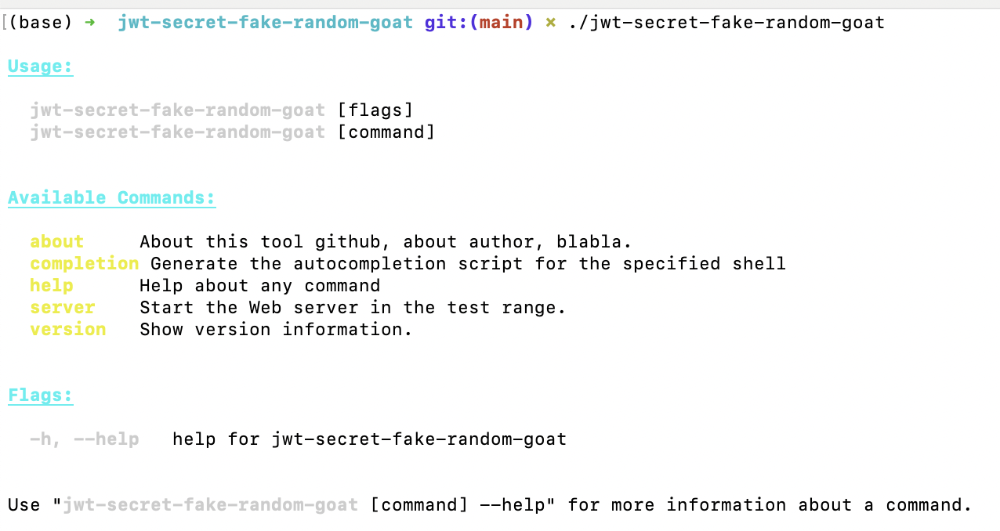
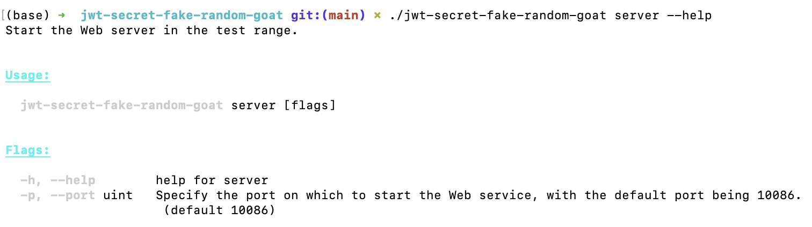
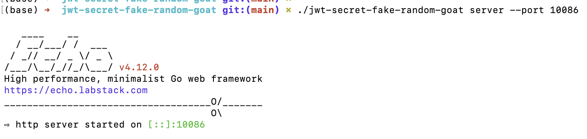
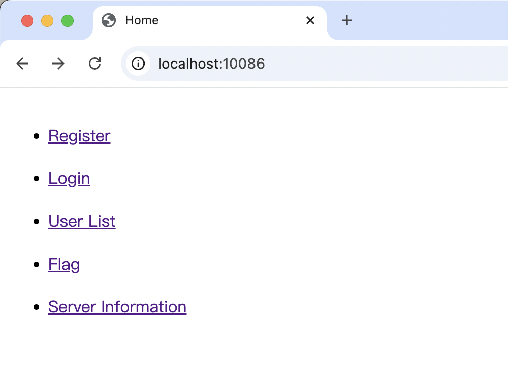

# JWT 伪随机生成secret案例练习靶场

# 一、这是什么？

在很多**开源**系统中，使用的是JWT作为认证体系，而JWT里最关键的是secret，对于secret一般有几种做法：
- 直接在配置文件中写死，对于开源系统来说会导致默认密码攻击，一般不推荐这种做法
- 程序启动时随机生成JWT的secret，后面就使用这个secret来签署JWT Token，看上去很安全，可是这个随机生成真的随机吗？

这个靶场就是把随机生成JWT的secret的场景抽象了一个最小化部分出来，来尝试攻击它获取flag吧！

提示：弱PRNG攻击！
# 二、启动服务

## 2.1 获取可执行文件 

### 方式一：下载预编译文件

在Release页面下载自己系统对应的编译好的二进制文件：

```text
https://github.com/cryptography-research-lab/jwt-secret-fake-random-goat/releases
```

### 方式二：自行编译

自行编译需要安装了Golang，克隆仓库：

```bash
git clone https://github.com/cryptography-research-lab/jwt-secret-fake-random-goat.git
```

进入克隆的仓库，编译源代码：

```bash
go build
```

然后执行编译产物：

```bash
./jwt-secret-fake-random-goat
```

## 2.2 启动服务

执行看一下用法：



需要关注的就是server参数：



启动Web Server，端口可以不指定，默认端口为10086：

```bash
./jwt-secret-fake-random-goat server --port 10086
```

启动成功： 



然后打开浏览器地址查看：

```bash
http://127.0.0.1:10086/
```

看到如下界面说明启动成功了：

## 2.3 使用Docker部署

### 从Docker Hub快速部署（推荐）

最简单的方式是直接拉取已发布的Docker镜像：

```bash
# 拉取镜像
docker pull cc11001100/jwt-secret-fake-random-goat:latest

# 运行容器
docker run -d -p 10086:10086 --name jwt-secret-fake-random-goat cc11001100/jwt-secret-fake-random-goat:latest

# 查看日志
docker logs -f jwt-secret-fake-random-goat

# 停止并删除容器
docker stop jwt-secret-fake-random-goat
docker rm jwt-secret-fake-random-goat
```

### 使用Docker Compose（推荐本地开发）

确保已安装Docker和Docker Compose，然后在项目根目录执行：

```bash
# 启动服务（后台运行）
docker-compose up -d

# 查看服务状态
docker-compose ps

# 查看实时日志
docker-compose logs -f

# 停止服务
docker-compose down

# 停止并删除相关卷（完全清理）
docker-compose down -v
```

服务将在后台启动，默认端口为10086。启动后可通过 http://localhost:10086/ 访问。

### 本地构建Docker镜像

```bash
# 构建镜像
docker build -t jwt-secret-fake-random-goat .

# 运行容器
docker run -d -p 10086:10086 --name jwt-secret-fake-random-goat jwt-secret-fake-random-goat

# 查看日志
docker logs -f jwt-secret-fake-random-goat

# 停止并删除容器
docker stop jwt-secret-fake-random-goat
docker rm jwt-secret-fake-random-goat

# 删除镜像（可选）
docker rmi jwt-secret-fake-random-goat
```

### Docker部署注意事项

1. **端口映射**：默认使用10086端口，可通过修改docker-compose.yml或使用`-p`参数自定义
2. **数据持久化**：当前用户数据存储在内存中，容器重启后会重置
3. **健康检查**：Docker Compose配置了健康检查，确保服务正常运行
4. **生产环境**：建议添加资源限制和安全配置



# 三、游戏规则

-  靶场系统包含一个简单的用户模块，可以注册、登录、查看系统中当前所有用户（内存存储，重启重置）
- CC11001100是内置用户，不能被注册（注意用户名区分大小写），并且仅有CC11001100才能查看flag
- 你需要伪造 CC11001100 的身份凭证访问 http://127.0.0.1:10086/flag.html 页面，才能查看到flag

玩得开心！

# 四、writeup 
脚本见：https://github.com/cryptography-research-lab/jwt-secret-fake-random-goat/blob/main/writeup/main.go

既然看到了，来补充个writeup吧，提个pr我来merge ：）